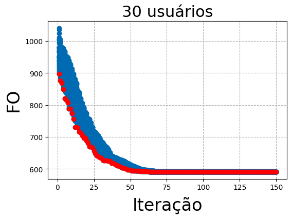
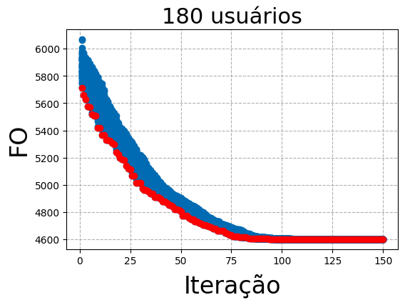
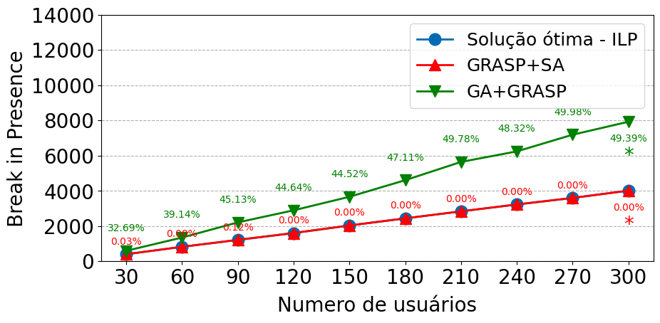
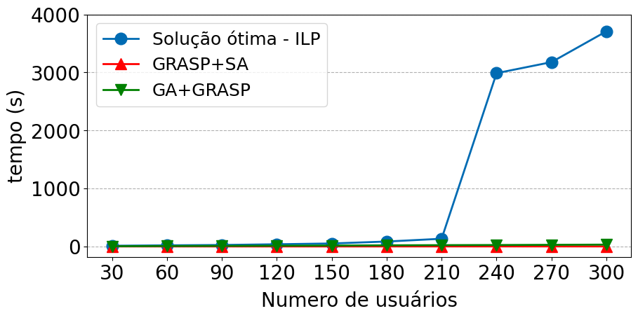

# META_H_PROJECT
Implementação de metaheurísticas para a resolução do  problema de associação usuários e estações de radio em um cenário de aplicações imersivas com o objetivo de minimizar a quebra de presença imersiva.

# Experimentação
30  users ---------- limit 9

60  users ---------- limit 18

90  users ---------- limit 27

120  users ---------- limit 36

150  users ---------- limit 45

180  users ---------- limit 54

210  users ---------- limit 63

240  users ---------- limit 72

270 users ---------- limit 81

300 users ---------- limit 90

# Resultados

## GA convergência
<table>
  <tr>
    <td></td>
    <td></td>
    <td></td>
  </tr>
</table>

## Conparação
<table>
  <tr>
    <td></td>
    <td></td>
  </tr>
</table>